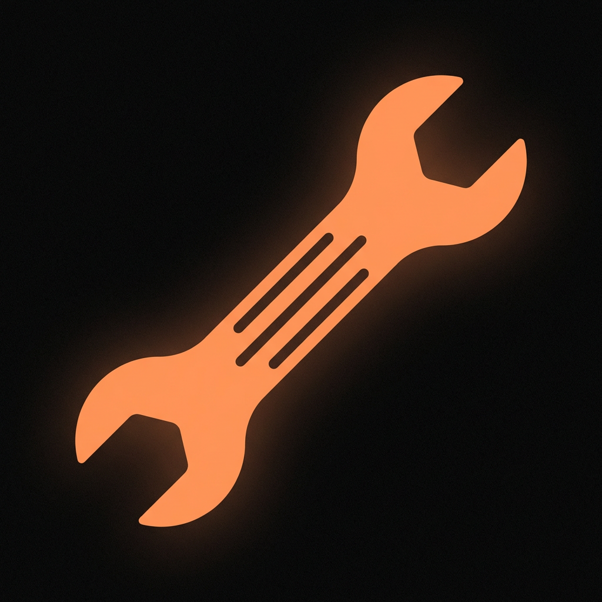

<div align="center">



<br/>

# wrench

**The config layer for your Droid.**

Tune models, autonomy, sound, security, and every other Factory CLI setting — from a terminal UI that feels at home in the Factory ecosystem.

<br/>

[](https://go.dev)
[](https://github.com/kaan-escober/wrench)
[](LICENSE)

</div>

---

```
D R O I D  CONFIG
  ~/.factory/settings.json

>  BYOK   Custom Models        9 model(s) configured
   MOD    Model & Reasoning    opus  ·  auto
   AUTO   Autonomy             normal
   DISP   Display              github  ·  pinned
   SND    Sound                fx-ok01  ·  always
   SEC    Security             ● shield  ● co-author  ○ bg-proc
   BEHV   Agent Behavior       ● cloud  ○ hooks  ● droids
   CMD    Command Policies     factory defaults

────────────────────────────────────────────
↑↓ navigate  enter · open  ctrl+c quit          DROID CONFIG
```

---

## What it does

wrench is a keyboard-driven TUI for everything in `~/.factory/settings.json`.

| Area | What you can configure |
|------|------------------------|
| **BYOK** | Add custom AI models from any OpenAI-compatible or Anthropic-compatible provider |
| **Model** | Default model and reasoning effort level |
| **Autonomy** | How aggressively Droid executes without asking |
| **Display** | Diff mode, todo placement, AI thinking visibility |
| **Sound** | Completion and input-awaiting sounds, focus rules |
| **Security** | Droid Shield, co-authored commits, background processes |
| **Behavior** | Cloud sync, IDE auto-connect, custom droids, hooks, spec save |
| **Commands** | Per-command allowlist and denylist |

Every change is written atomically — no partial writes, no lost fields.

---

## Install

```bash
git clone https://github.com/kaan-escober/wrench.git
cd wrench
go build -o wrench .
mv wrench /usr/local/bin/   # or $PREFIX/bin/ on Termux
```

**Termux (Android/arm64)**

```bash
pkg install golang git
git clone https://github.com/kaan-escober/wrench.git
cd wrench && go build -o wrench . && mv wrench $PREFIX/bin/
```

Requires [Factory CLI](https://docs.factory.ai/cli/getting-started/quickstart) to be installed. wrench reads and writes the same `settings.json` that Droid uses.

---

## Keys

| Key | Action |
|-----|--------|
| `↑` `↓` or `k` `j` | Navigate |
| `Enter` | Open / confirm |
| `Esc` | Back / cancel |
| `Tab` | Switch column (command editor) |
| `Space` | Toggle model (BYOK wizard) |
| `a` / `d` | Add / delete command |
| `Ctrl+C` | Quit |

---

## BYOK wizard

Select **Custom Models** from the main menu to add any external AI model to Droid.

```
PROVIDER  →  BASE URL  →  DISPLAY NAME  →  API KEY
         →  FETCH MODELS  →  SELECT  →  TOKENS  →  IMAGES
         →  CONFIRM  →  DONE
```

Supports raw API keys and `${ENV_VAR}` references. Saved providers reappear at the top of the list on every run.

**Built-in providers:** OpenRouter · OpenAI · Anthropic · Groq · Gemini · DeepInfra · Fireworks · Hugging Face · Ollama · any custom URL

---

## Storage

| File | Purpose |
|------|---------|
| `~/.factory/settings.json` | Factory CLI settings — the file Droid reads |
| `~/.byok-cli/providers.json` | Saved providers and API keys |
| `~/.byok-cli/models.json` | Full record of added custom models |

Writes to `settings.json` are atomic (temp file + rename) and field-preserving — hooks, workspace config, and anything else Factory stores there is never touched.

---

## Built with

[Bubble Tea](https://github.com/charmbracelet/bubbletea) · [Lip Gloss](https://github.com/charmbracelet/lipgloss) · [Bubbles](https://github.com/charmbracelet/bubbles)

---

## Docs

- [Getting Started](docs/getting-started.md)
- [BYOK Wizard](docs/byok.md)
- [Settings Reference](docs/settings.md)
- [Providers](docs/providers.md)
- [Configuration Files](docs/configuration.md)
- [Troubleshooting](docs/troubleshooting.md)

---

<div align="center">
<sub>Made for the Factory ecosystem · MIT License</sub>
</div>
